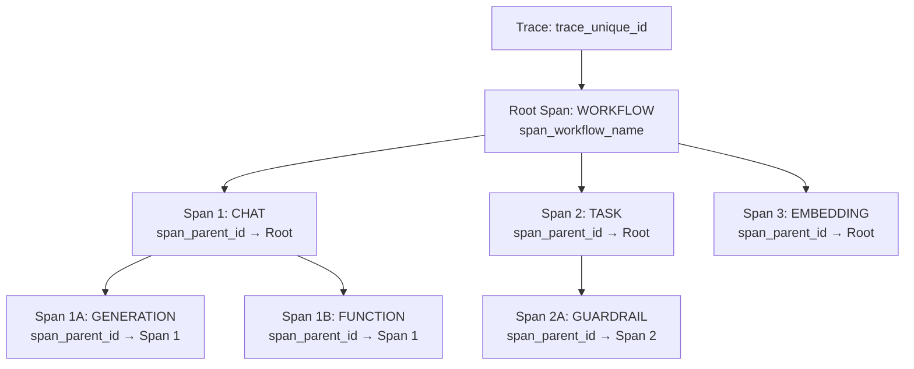
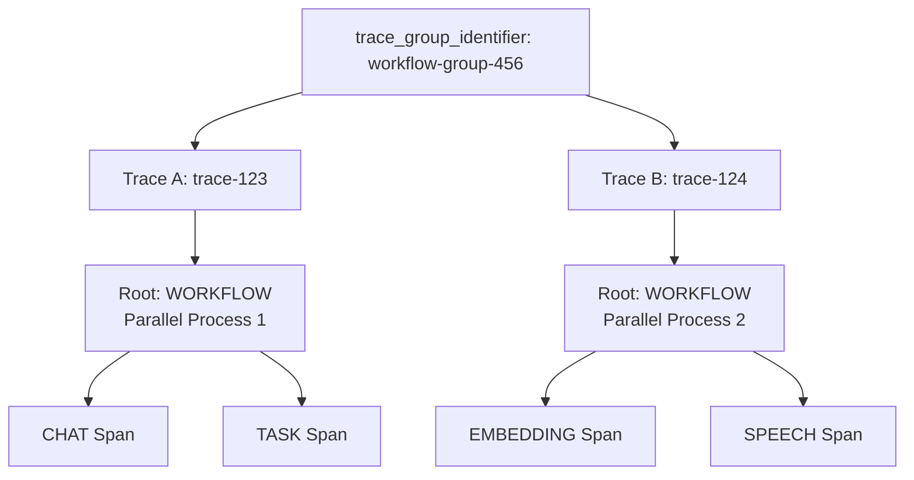

## Overview

Respan's observability is built around one core concept: **different views of the same underlying data**. All views present the same log data, just organized differently for different use cases:

<CardGroup cols={2}>
<Card title="Logs" icon="list">
  **Plain view** - Individual LLM requests as they happen
</Card>
<Card title="Traces" icon="route">
  **Hierarchical view** - Multi-step workflows and AI agent operations
</Card>
<Card title="Threads" icon="messages">
  **Conversational view** - Linear chat interface for dialogue systems
</Card>
<Card title="Scores" icon="chart-line">
  **Evaluation view** - Quality assessments and performance metrics
</Card>
</CardGroup>

<Warning>
All four views show the **same underlying data** - they just organize and present it differently. The core data structure remains consistent across all views.
</Warning>

## Logs

<Info>
A log represents a single LLM request and contains all the information about that interaction. This is the foundational data that powers all other views.
</Info>

### Core fields

<AccordionGroup>
<Accordion title="Metrics">
- start_time — Request start time (RFC3339)
- timestamp — Span end time (RFC3339)
- prompt_tokens — Tokens in the prompt/input
- completion_tokens — Tokens in the model output
- prompt_cache_hit_tokens — Tokens served from cache
- prompt_cache_creation_tokens — Tokens added to cache
- total_request_tokens — Sum of prompt and completion tokens
- latency — Total request latency in seconds
- time_to_first_token — Time to first token (seconds)
- tokens_per_second — Output token throughput (TPS)
- routing_time — Deprecated: time spent deciding the model/route
- cost — Total request cost (USD)
</Accordion>

<Accordion title="Metadata">
- unique_id — Request unique identifier
- UNIQUE_ORGANIZATION_ID_KEY — Organization unique identifier
- organization_key_id — API key identifier
- environment — Runtime environment (e.g., test, prod)
- customer_identifier — User/customer-level identifier
- evaluation_identifier — Evaluator run identifier
- prompt_id — Prompt identifier
- prompt_version_number — Prompt version number
- custom_identifier — Custom identifier provided by client
- thread_identifier — Logical thread identifier
- thread_unique_id — Unique thread identifier
- trace_unique_id — Trace identifier
- span_unique_id — Span identifier
- span_name — Span name
- span_parent_id — Parent span identifier
- span_workflow_name — Workflow name associated with span
- trace_group_identifier — Group identifier for related traces
- deployment_name — Deployment name
- provider_id — Provider identifier
- model — Model name
- status_code — HTTP-like status code
- status — Status string
- tool_calls — Tool calls recorded
</Accordion>

<Accordion title="LLM configuration">
- stream
- stream_options
- temperature
- max_tokens
- logit_bias
- logprobs
- top_logprobs
- frequency_penalty
- presence_penalty
- stop
- n
- response_format
- verbosity
- tools
</Accordion>

<Accordion title="Input and Output">
- input — Universal input field containing JSON-serialized request data
- output — Universal output field containing JSON-serialized response data
- prompt_messages — (Legacy) Messages sent to the model (extracted from input for chat/completion types)
- completion_message — (Legacy) Final assistant message from the model (extracted from output for chat/completion types)
</Accordion>
</AccordionGroup>

### Universal input/output design

<Info>
**Respan uses universal `input` and `output` fields across all log types.** These fields contain JSON-serialized data that represents the complete request and response for any span type.
</Info>

The system automatically:
- Serializes your data into `input` and `output` fields
- Extracts type-specific fields (like `prompt_messages`, `completion_message`) for backward compatibility
- Calculates metrics (cost, tokens, latency)
- Validates and sanitizes all fields

This design allows you to log any data structure while maintaining compatibility with legacy fields.

### Log types

All logs are categorized by type to help with filtering and organization:

<Tabs>
<Tab title="LLM inference">
- **`chat`**: Conversational chat completions (most common)
  - Input: Array of messages `[{"role": "user", "content": "..."}]`
  - Output: Message object `{"role": "assistant", "content": "..."}`
- **`completion`**: Legacy completion format
- **`response`**: Response API calls
- **`embedding`**: Vector embedding generation
  - Input: Text string or array of texts
  - Output: Vector embeddings array
- **`transcription`**: Speech-to-text conversion
  - Input: JSON with audio metadata `{"audio_url": "...", "filename": "..."}`
  - Output: Transcribed text string
- **`speech`**: Text-to-speech generation
  - Input: Text string to be spoken
  - Output: JSON with audio metadata `{"audio_url": "...", "filename": "..."}`
- **`text`**: (Deprecated) Use `chat` instead
</Tab>

<Tab title="Workflow & agent">
- **`workflow`**: Root-level workflow orchestration
- **`task`**: Individual tasks within workflows
- **`tool`**: Tool or function calls
- **`agent`**: AI agent operations
- **`handoff`**: Agent-to-agent task transfers
- **`guardrail`**: Safety and validation checks
- **`function`**: Standalone function executions
</Tab>

<Tab title="Advanced">
- **`custom`**: User-defined custom operations
- **`generation`**: Detailed generation process tracking
- **`unknown`**: Fallback for unrecognized types
</Tab>
</Tabs>

### Example log structure

```json
{
  "id": "log_123",
  "log_type": "chat",
  "model": "gpt-4",
  
  // Universal fields (always present)
  "input": "[{\"role\":\"user\",\"content\":\"What is the capital of France?\"}]",
  "output": "{\"role\":\"assistant\",\"content\":\"The capital of France is Paris.\"}",
  
  // Extracted legacy fields (for backward compatibility)
  "prompt_messages": [
    {"role": "user", "content": "What is the capital of France?"}
  ],
  "completion_message": {
    "role": "assistant",
    "content": "The capital of France is Paris."
  },
  
  // Metrics
  "prompt_tokens": 8,
  "completion_tokens": 7,
  "total_tokens": 15,
  "cost": 0.0003,
  "latency": 1.2,
  "timestamp": "2024-01-15T10:30:00Z",
  "status": "success"
}
```

## Traces

<Info>
Traces organize the same log data into hierarchical workflows, perfect for complex AI agent operations and multi-step processes.
</Info>

Traces group related logs using **spans** to show the execution flow of multi-step processes. Each span corresponds to a log entry but adds hierarchical context.

### Trace structure



### Key trace fields

- **`trace_unique_id`**: Groups all spans in the same workflow
- **`span_unique_id`**: Individual span identifier (maps to log ID)
- **`span_parent_id`**: Creates the hierarchical structure
- **`span_name`**: Descriptive name for the operation
- **`span_workflow_name`**:  The nearest workflow this span belongs to

### Multi-trace grouping

Complex workflows can span multiple traces using `trace_group_identifier`:



## Threads

<Info>
Threads organize the same log data in a conversational format, ideal for chat applications and dialogue systems.
</Info>

### Thread structure
- **Thread ID**: Unique identifier for the conversation
- **Messages**: Ordered sequence of user and assistant messages (each message maps to log entries)

<Info>
Notice how each message in the thread references a `log_id` - this shows how threads are just a different presentation of the same underlying log data.
</Info>

## Scores

<Info>
Scores organize the same log data with evaluation metrics and quality assessments, perfect for monitoring LLM performance and conducting evaluations.
</Info>

Scores are evaluation results that are attached to specific logs. Each score represents a quality assessment or performance metric for a particular LLM request.


### Score structure

Scores are linked to logs through the `log_id` field and can be created by two types of evaluators:

- **Platform evaluators**: Use `evaluator_id` (UUID from Respan platform)
- **Custom evaluators**: Use `evaluator_slug` (your custom string identifier)

### Key score fields

- **`id`**: Unique score identifier
- **`log_id`**: Links the score to its corresponding log entry
- **`evaluator_id`**: UUID of Respan platform evaluator (optional)
- **`evaluator_slug`**: Custom evaluator identifier (optional)
- **`is_passed`**: Whether the evaluation passed defined criteria
- **`cost`**: Cost of running the evaluation
- **`created_at`**: When the score was created

<Info>
Each evaluator can only have one score per log, ensuring data integrity and preventing duplicate evaluations.
</Info>

### Score value types

<Warning>
**Critical: Use the correct value field based on evaluator's `score_value_type`**
</Warning>

Scores support four different value types based on the evaluator's `score_value_type`:

| Evaluator's `score_value_type` | Use This Field | Data Type | Example |
|--------------------------------|----------------|-----------|---------|
| `numerical` | `numerical_value` | number | `4.5` |
| `boolean` | `boolean_value` | boolean | `true` |
| `categorical` | `categorical_value` | array of strings | `["excellent", "coherent"]` |
| `comment` | `string_value` | string | `"Good response quality"` |

#### Detailed descriptions

**Numerical Scores**
- **Use case**: Ratings, confidence scores, quality metrics
- **Range**: Defined by evaluator's `min_score` and `max_score`
- **Example**: Rating response quality from 1-5

**Boolean Scores**
- **Use case**: Pass/fail evaluations, binary classifications
- **Values**: `true` or `false`
- **Example**: Content safety check

**Categorical Scores**
- **Use case**: Multi-choice classifications
- **Values**: Array of predefined choices from evaluator's `categorical_choices`
- **Example**: `["relevant", "accurate", "helpful"]`

**Comment Scores**
- **Use case**: Qualitative feedback, explanations
- **Values**: Free-form text
- **Example**: Detailed evaluation reasoning

### Evaluator types

Scores are created by evaluators, which come in three types:

**LLM Evaluators (`type: "llm"`)**
- AI-powered evaluation using language models
- Requires `evaluator_definition` prompt
- Supports all score value types

**Human Evaluators (`type: "human"`)**
- Manual evaluation by human reviewers
- Often used with categorical or comment scores
- Requires predefined choices for categorical

**Code Evaluators (`type: "code"`)**
- Programmatic evaluation using custom code
- Requires `eval_code_snippet`
- Most flexible for complex logic

<Note>
Legacy fields (`llm_input`, `llm_output`) are normalized to `input`/`output` when reading the `inputs` field.
</Note>