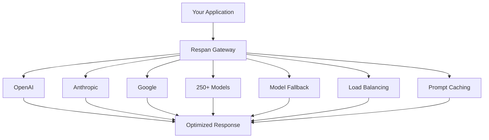

## What is Respan?
Respan is a **full-stack LLM engineering platform** that helps developers and PMs build reliable AI products 10x faster. In a shared workspace, product teams can **monitor**, **optimize**, and **improve** AI performance.

## Features

### Observability

Monitor your LLM applications with comprehensive visibility into performance, costs, and user interactions.

<Tabs>
<Tab title="Monitoring dashboard">
<Frame className="rounded-md">

</Frame>
</Tab>
<Tab title="LLM logging">
<Frame className="rounded-md">

</Frame>
</Tab>
<Tab title="Agent tracing">
<Frame className="rounded-md">

</Frame>
</Tab>
<Tab title="User analytics">
<Frame className="rounded-md">

</Frame>
</Tab>
</Tabs>

<CardGroup cols={2}>
  <Card
    title="Logging quickstart"
    icon="file-lines"
    href="/get-started/quickstart/logging"
  >
    Send your existing LLM calls to Respan for observability
  </Card>
  <Card
    title="Tracing quickstart"
    icon="sitemap"
    href="/get-started/quickstart/tracing"
  >
    Monitor complex agent workflows step-by-step
  </Card>
</CardGroup>

### Prompt management

Isolate prompts from code, collaborate with your team, and iterate faster with version control.

<Tabs>
<Tab title="Prompt playground">
<Frame>

</Frame>
</Tab>
<Tab title="Prompt editor">
<Frame>

</Frame>
</Tab>
<Tab title="Metrics monitoring">
<Frame>

</Frame>
</Tab>
<Tab title="Version control">
<Frame>

</Frame>
</Tab>
</Tabs>

<CardGroup cols={1}>
  <Card
    title="Prompt management quickstart"
    icon="wand-magic-sparkles"
    href="/get-started/quickstart/prompt_management"
  >
    Create, version, and deploy prompt templates with team collaboration
  </Card>
</CardGroup>

### Evaluations

Test your prompts systematically with evaluators, datasets, and experiments.

<Tabs>
<Tab title="Experiments">
<Frame>

</Frame>
</Tab>
<Tab title="Evaluators">
<Frame>

</Frame>
</Tab>
<Tab title="Datasets & scores">
<Frame>

</Frame>
</Tab>
</Tabs>

<CardGroup cols={1}>
  <Card
    title="Evaluation quickstart"
    icon="chart-simple"
    href="/get-started/quickstart/evaluation"
  >
    Set up automated testing with evaluators, datasets, and experiments
  </Card>
</CardGroup>

### AI gateway

Interface with 250+ LLMs via one unified API with built-in optimization features.

<CardGroup cols={1}>
  <Card
    title="AI gateway quickstart"
    icon="route"
    href="/get-started/quickstart/gateway"
  >
    Connect to 250+ models with unified API, fallbacks, and cost optimization
  </Card>
</CardGroup>

## Why Respan?

Respan is the **only platform** that combines AI Gateway, Observability, Prompt Management, and Evaluations in one unified solution. Unlike other tools that focus on single aspects of LLM development, we provide everything you need to build, monitor, and improve AI applications.

<CardGroup cols={2}>
  <Card title="Unified platform" icon="puzzle-piece">
    No need to integrate multiple tools - all core features in one solution
  </Card>
  <Card title="24/7 support" icon="headset">
    Dedicated support team available around the clock
  </Card>
  <Card title="Simple setup" icon="rocket">
    Get started in minutes with our managed platform and straightforward integration process
  </Card>
  <Card title="Enterprise ready" icon="shield">
    SOC 2, GDPR, and HIPAA compliant with enterprise-grade security and scalability built for production environments
  </Card>
</CardGroup>

### Platform comparison

| Feature | **Respan** | Langfuse | Helicone | Braintrust |
|:--------|:---------------:|:--------:|:--------:|:----------:|
| **AI gateway** | ✅ | ❌ | ✅ | Limited |
| **Observability** | ✅ | ✅ | ✅ | ✅ |
| **Prompt management** | ✅ | ✅ | Limited | ✅ |
| **Evaluations** | ✅ | ✅ | ❌ | ✅ |
| **Team collaboration** | ✅ | ✅ | ✅ | ✅ |
| **Setup complexity** | Simple | Hard | Simple | Medium |
| **Hosting** | Managed | Open Source | Managed | Enterprise |
| **Support service** | 24/7 dedicated | GitHub (24-48h) | Contact form | Support center |

## Support

<CardGroup cols={3}>
  <Card
    title="Join Discord"
    icon="discord"
    href="https://discord.com/invite/KEanfAafQQ"
  >
    Connect with our community
  </Card>
  <Card
    title="Book a demo"
    icon="calendar"
    href="https://cal.com/respan"
  >
    Schedule a personalized walkthrough
  </Card>
  <Card
    title="Support center"
    icon="life-ring"
    href="/documentation/support"
  >
    Get help and documentation
  </Card>
</CardGroup>
