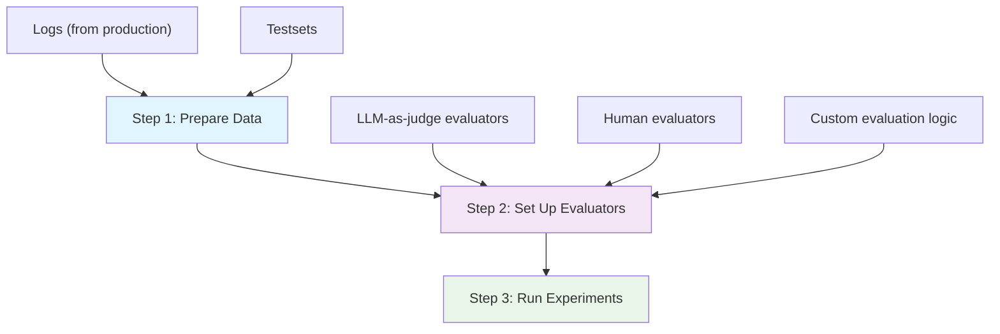

## What is evaluations?
Evaluations help you assess the performance of your prompts. You can create custom evals to measure different dimensions of output quality.

## Why use evaluations?
- To measure the quality of a prompt or a model.
- To find the best prompt or model for a specific task.
- To optimize your prompts and models.

## Quickstart

---
<CardGroup cols={2}>
<Card title="LLM-as-judge evaluator" href="/documentation/products/evaluation/llm-evals/llm-evaluator">
    Create an LLM-as-judge evaluator to measure the quality of your prompts.
</Card>
<Card title="Create a human evaluator" href="/documentation/products/evaluation/human-evals/human-evals-setup">
    Create a human evaluator to measure the quality of your prompts.
</Card>
<Card title="Run experiments with testsets" href="/documentation/products/evaluation/experiments/overview">
    Run experiments with testsets to measure the performance of your prompts.
</Card>
</CardGroup>

