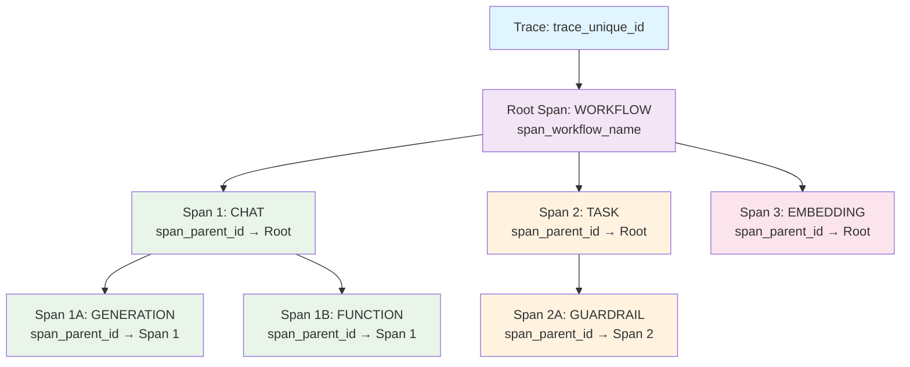
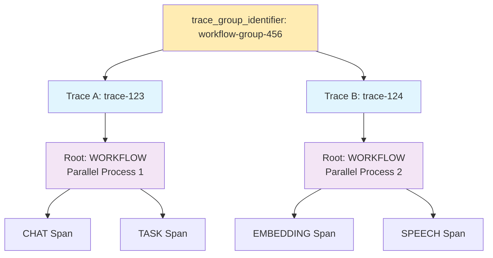
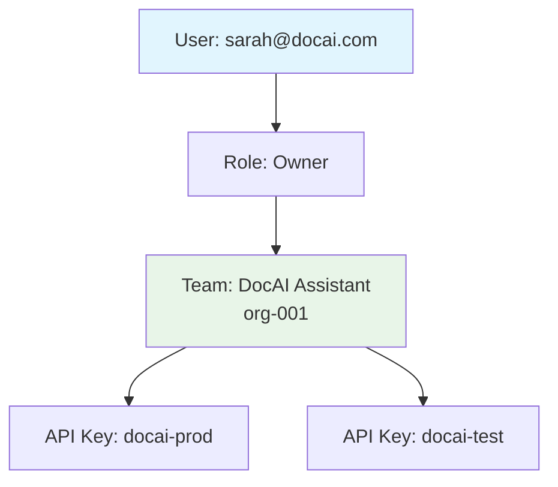
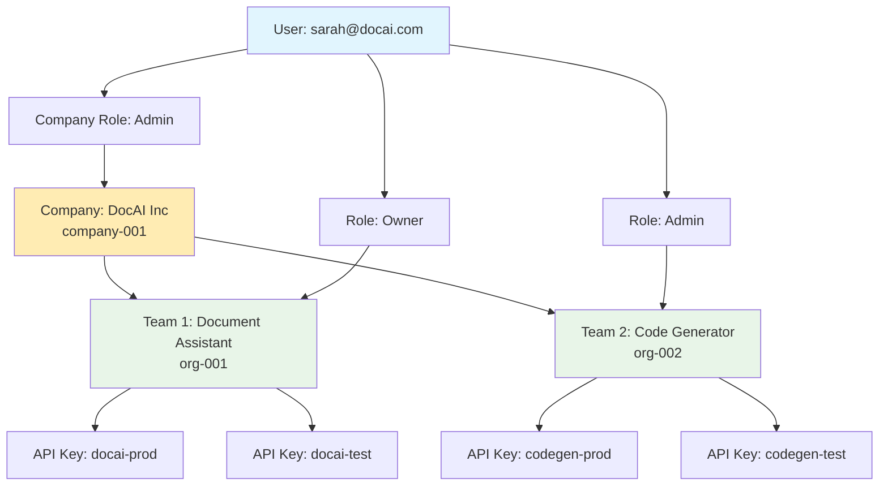
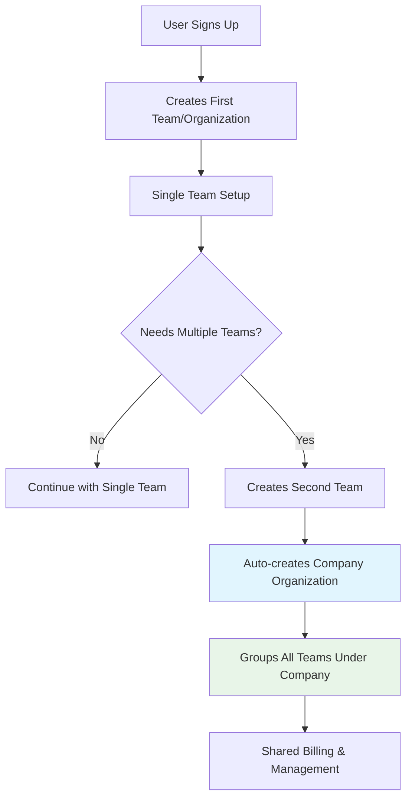
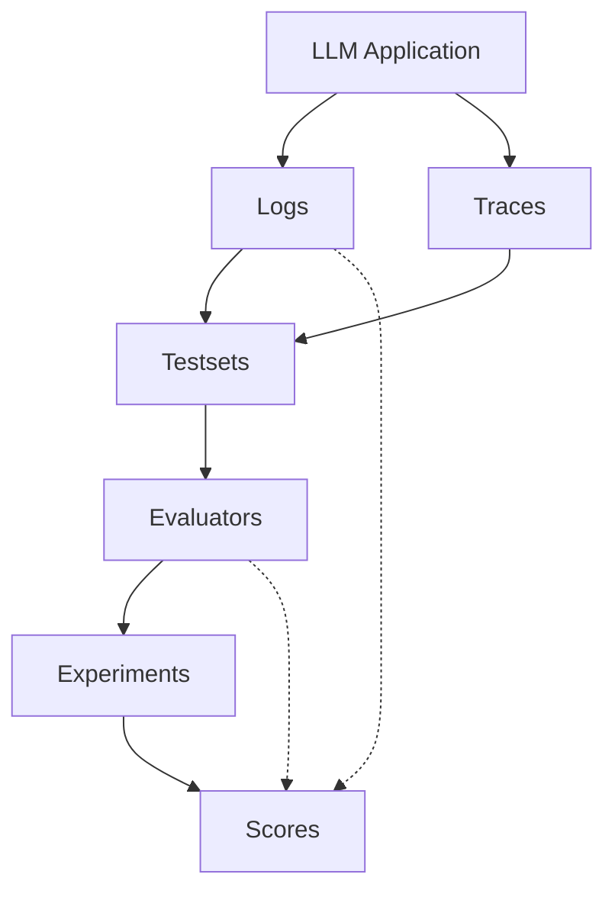

Respan provides two main types of observability: **Traces** for agent workflows and **Logs** for LLM calls, plus a comprehensive **Evaluation** framework.

## Traces vs Logs

<CardGroup cols={2}>
<Card title="Logs" icon="file">
  **LLM call logging** - Individual requests and responses to language models
</Card>
<Card title="Traces" icon="route">
  **Agent tracking** - Complete workflows with multiple steps
</Card>
</CardGroup>

### Logs
<Info>
Logs record individual LLM API calls and responses
</Info>

- Single request/response pairs
- Token usage and costs
- Model performance metrics
- Error tracking
- Response latency

<AccordionGroup>
  <Accordion title="Log Parameters" icon="sliders">
    <AccordionGroup>
      <Accordion title="Content Types">
        - Text
        - Chat
        - Completion
        - Response
        - Embedding
        - Transcription
        - Speech
        - Workflow
        - Task
        - Tool
        - Agent
        - Handoff
        - Guardrail
        - Function
        - Custom
        - Generation
      </Accordion>
      <Accordion title="Filtering Metrics">
        - Status (Error, Success)
        - Time
        - Trace ID
        - Workflow name
        - Customer ID
        - Span count
        - Error count
        - Input token count
        - Output token count
        - Total tokens
        - Duration
      </Accordion>
    </AccordionGroup>
  </Accordion>
</AccordionGroup>

### Traces
<Info>
Traces capture the full execution flow of agent workflows
</Info>

- Multi-step agent processes
- Tool calls and function executions
- Decision-making steps
- Hierarchical workflow visualization
- Agent reasoning and planning

<AccordionGroup>
  <Accordion title="Trace Parameters" icon="sliders">
    <AccordionGroup>
      <Accordion title="Filtering Metrics">
        - Thread ID
        - Customer ID
        - API key
        - Input tokens
        - Output tokens
        - All tokens
        - Cost
        - Generation
        - Number of Rows
      </Accordion>
    </AccordionGroup>
  </Accordion>
</AccordionGroup>

## Trace Data Model

### Trace Structure

### Multi-Trace Workflow Grouping

## Organization Data Model

### Single Team Setup (Initial Onboarding)

### Multi-Team Setup (After Scaling)

### User Journey

## User Data

<Info>
User data provides insights into customer usage patterns and activity
</Info>

<AccordionGroup>
  <Accordion title="User Parameters" icon="user">
    - Customer ID
    - Name
    - Email
    - Requests
    - Total tokens
    - Total cost
    - Active for
  </Accordion>
</AccordionGroup>

## Testsets

<Info>
Testsets allow systematic evaluation of model performance
</Info>

<AccordionGroup>
  <Accordion title="Testset Parameters" icon="vial">
    - Testset ID
    - Name
    - Created At
    - Updated At
    - Row Count
    - Column Count
    - Starred
  </Accordion>
</AccordionGroup>

## Evaluation Framework

The evaluation system helps you assess and improve LLM performance through systematic testing.

### Testsets
<Tip>
Curated collections of examples for evaluation
</Tip>

- Input/output pairs
- Expected responses
- Evaluation criteria
- Test case metadata

### Evaluators
<Tip>
Tools that assess LLM output quality
</Tip>

**Types of evaluators:**
- **LLM Evaluators**: AI-powered assessment
- **Human Evaluators**: Manual review
- **Rule-based**: Automated validation
- **Custom Metrics**: Domain-specific scoring

### Experiments
<Tip>
Comparative testing of different configurations
</Tip>

- A/B testing of prompts
- Model comparisons
- Performance benchmarking
- Cost analysis

### Scores
<Tip>
Quantitative and qualitative assessment results
</Tip>

<AccordionGroup>
  <Accordion title="Score Types">
    - **Numerical values**: Ratings on scales (1-5, 1-10, percentages)
    - **Boolean values**: Pass/fail assessments
    - **String values**: Textual feedback and classifications
  </Accordion>
  
  <Accordion title="Score Properties">
    - Unique per evaluator per log
    - Includes creation timestamp
    - Can be managed via API
    - Automatically enriches log data
  </Accordion>
  
  <Accordion title="Score Relationships">
    - Connected to specific logs via `log_id`
    - Associated with evaluators via `evaluator_id` or `evaluator_slug`
    - Can be part of test sets via `dataset_id`
    - Provides context through `type` and `environment` fields
  </Accordion>
</AccordionGroup>

## Data Flow

<Info>
Important terminology notes:
- "testsets" is one word in our product
- A "log" is actually a type of "trace" in our system
</Info>

## Score Integration

Scores are integrated throughout the Respan platform:

<AccordionGroup>
  <Accordion title="Log Enrichment" icon="file-circle-plus">
    Scores automatically appear in log details under the `scores` field
  </Accordion>
  
  <Accordion title="Evaluation Results" icon="chart-simple">
    Scores provide quantitative metrics for evaluating model performance
  </Accordion>
  
  <Accordion title="API Access" icon="code">
    Create, retrieve, update, and delete scores programmatically
  </Accordion>
  
  <Accordion title="Filtering" icon="filter">
    Filter logs and test results based on score values
  </Accordion>
</AccordionGroup>